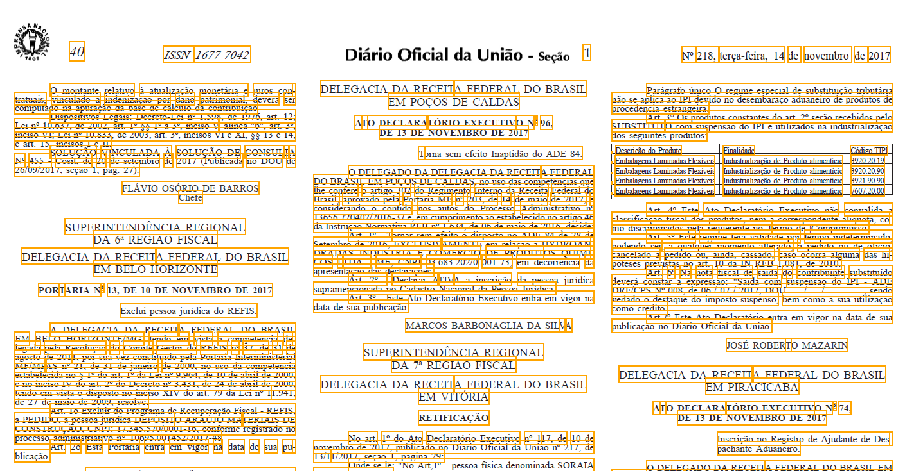

PDFTextReader
===============

Tool to extract data from Diario Oficial da União (DOU) stored in PDF file.

# Architecture #
 
The project has a pipeline for processing the incoming PDF file.

## Problem: PDF has no concept of column, paragraph or line ##

PDF is just a collection of characters spread out in a document page. Sometimes we can tell that characters form a word due to its spacing characteristics. However, this spacing can be variable and breaks the word.

Examples:
- Por-t-aria (*correct: Portaria*)
- A-T-O DECLARA-TÓRIO (*correct: ATO DECLARATÓRIO*)
- CONSUL-T-A (*correct: CONSULTA*)

This block behavior brought us interesting surprises:

- Hidden characters to human (font size too small), but visible to machines
- Characters composed of multiple characters. Eg, Euro sign (€) is represented not as a Unicode, but with overlapped characters: `C` and `=`
- Characters in different sizes. Eg, ordinal number (Nº) is represented with `N`, `o`, `-` and it is read as `No-` by the machine. However, the `o` and `-` are printed with smaller fonts and higher baselines.

## Finding the Lines ##

The first problem was to find out when the characters are grouped into a single line. It is usually easy to tell that the characters are on the same baseline.

Major exceptions:
- Table rows (large spacing between the columns)
- Overlapped characters to represent a special character
- Multiple font sizes and types (eg, words in either bold and italic in the line - you cannot say that the line is all bold and italic)

## Identifying the Block Sets ##

The next step is to group the lines into block sets. We want to measure the distance between the lines, and have the closest lines forming a blockset. At least one blockset per column, but no blockset spans multiple columns.

The image shows that sometimes we incorrectly classify the blocks. 

One of the most difficult task was to identify the Header and Footer of the page. There are multiple variations of header/footer in size and sometimes they are not present in the document. On the other hand, it is easy to check whether we correctly classified header/footer along the whole document.

Thus, analyzing headers and footers in the scope of a page is difficult. However, it is easy to analyze in the global scope of the document.
