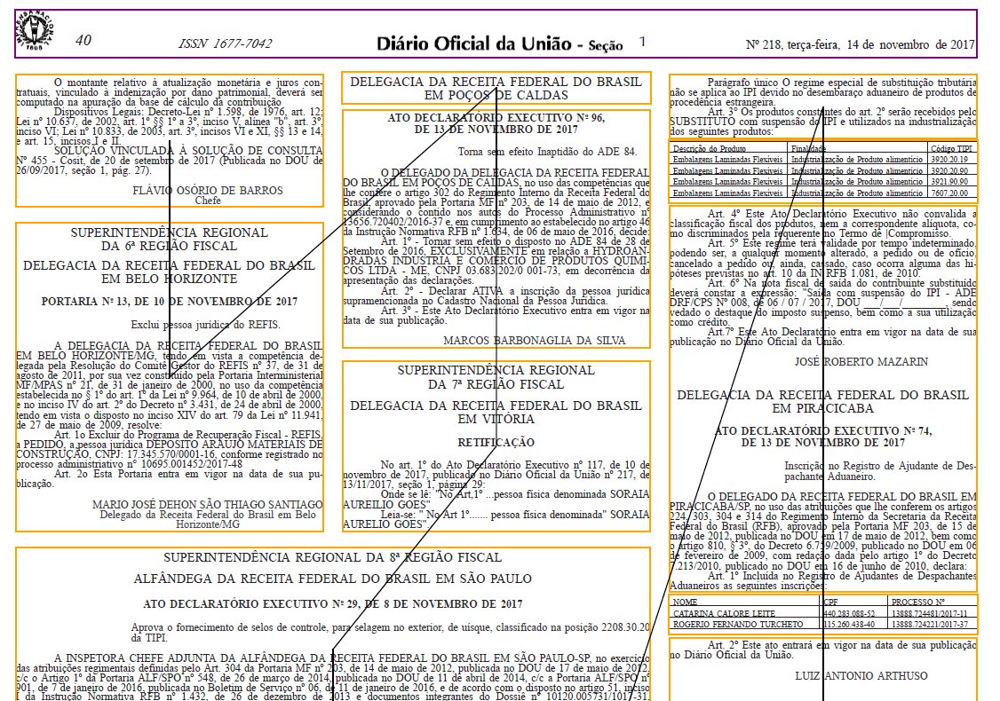

PDFTextReader
===============

Tool to extract data from Diario Oficial da União (DOU) stored in PDF file.

# Architecture #
 
The project has a pipeline for processing the incoming PDF file.

## Problem: PDF has no concept of column, paragraph or line ##

PDF is just a collection of characters spread out in a document page. Sometimes we can tell that characters form a word due to its spacing characteristics. However, this spacing can be variable and breaks the word.

Examples:
- Por-t-aria (*correct: Portaria*)
- A-T-O DECLARA-TÓRIO (*correct: ATO DECLARATÓRIO*)
- CONSUL-T-A (*correct: CONSULTA*)

This block behavior brought us interesting surprises:

- Hidden characters to human (font size too small), but visible to machines
- Characters composed of multiple characters. Eg, Euro sign (€) is represented not as a Unicode, but with overlapped characters: `C` and `=`
- Characters in different sizes. Eg, ordinal number (Nº) is represented with `N`, `o`, `-` and it is read as `No-` by the machine. However, the `o` and `-` are printed with smaller fonts and higher baselines.

## Defining the Lines ##

The first problem was to find out when the characters are grouped into a single line. It is usually easy to tell that the characters are on the same baseline.

Major exceptions:
- Table rows (large spacing between the columns)
- Overlapped characters to represent a special character
- Multiple font sizes and types (eg, words in either bold and italic in the line - you cannot say that the line is all bold and italic)

## Identifying the Block Sets ##

The next step is to group the lines into block sets. We want to measure the distance between the lines, and have the closest lines forming a blockset. At least one blockset per column, but no blockset spans multiple columns.

The image shows that sometimes we incorrectly classify the blocks. 

One of the most difficult task was to identify the Header and Footer of the page. There are multiple variations of header/footer in size and sometimes they are not present in the document. On the other hand, it is easy to check whether we correctly classified header/footer along the whole document.

Thus, analyzing headers and footers in the scope of a page is difficult. However, it is easy to analyze in the global scope of the document.

## PDF Printing Order ##

A file is a sequence of bytes that represents the characters and words of a PDF file. However, there is no high-level concept of lines, paragraphs or columns. We can say that PDF behaves more like a PostScript instruction set rather than a semantic HTML document. 

The characters and words are presented in no specific order. In our case study, we usually see the header and footer in the beginning of the file. But we also found exceptions to this.

The challenge is to identify what is a title or content (body). There is no explicit mark or tag to differentiate the content type. So we usually tell the title by the font size, the visual centered aligment and the upper case. Again, that is not a strict rule though.

There is no concept of tables or forms in PDF. Compared to HTML, there is no `<table><tr><td>` neither `<form><input type=..>`. We have only characters printed in front of a background image, which contains the grid lines.

In order to reconstruct the tables, we have to parse all the line segments and glue them together. Then we have the concept of what is a rectangle, and then we look for text around and finally we have a table.

## Blockset Order ##

Once we understand what are text, image and tables, we can lay the blocks in the page. The last problem is to define the correct reading order - that is not simply left-right, up-down.

The problem is complex because a single page can have 1, 2 or 3 columns. Sometimes the columns can be merged, so it is not unusual to see a column fitting into a 2/3 of the page.
